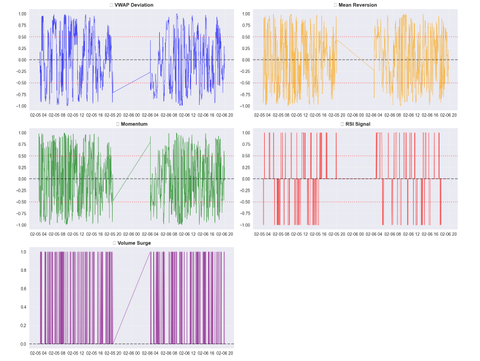
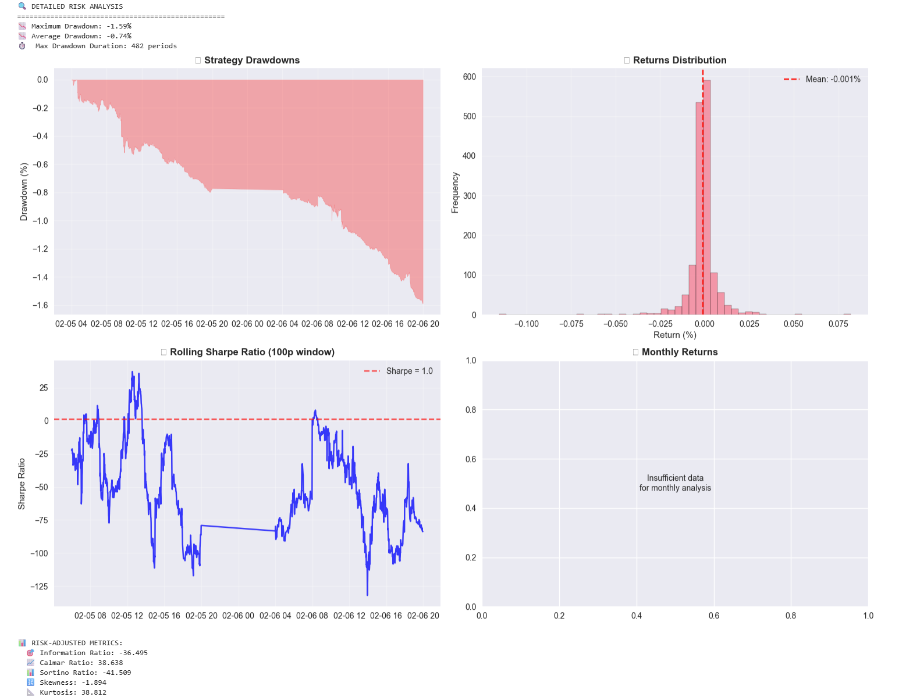
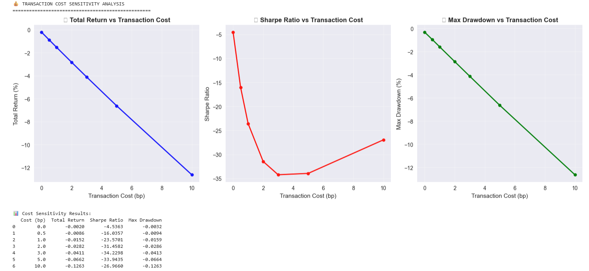
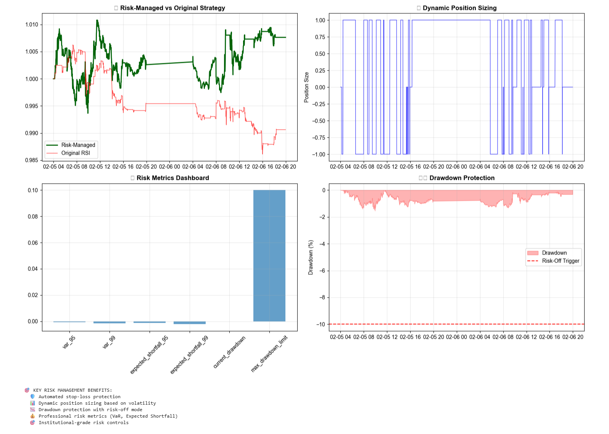
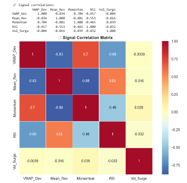

# Alpha Orderbook Signals

[](https://github.com/mathieudelehaye/orderbook-alpha-signals/actions)
[](https://www.python.org/downloads/)
[](https://opensource.org/licenses/MIT)

**Enterprise-grade quantitative trading research toolkit** for engineering orderbook-style signals and backtesting intraday alpha strategies. This repository contains **no raw market data** — users fetch data with their own API credentials.


*Enterprise-grade risk management with automated stop-loss, dynamic position sizing, and institutional-quality risk controls*

## 📷 Technical Analysis Screenshots

### Market Data Visualization

*Professional AAPL 1-minute price and volume data with market hours highlighting and timezone-aware analysis*

### Signal Engineering Dashboard

*Comprehensive 5-panel signal analysis showing VWAP deviation, mean reversion, momentum, RSI, and volume surge indicators*

### Signal Correlation Analysis

*Professional correlation matrix revealing signal relationships and diversification opportunities*

### Transaction Cost Sensitivity Analysis

*Strategy robustness testing across transaction cost scenarios demonstrating production-ready risk assessment*

## 🚀 Key Features

### Core Functionality
- **📡 Real-time Data Ingestion** - Polygon.io REST API with advanced error handling & rate limiting
- **⚡ Signal Engineering** - 8 orderbook-style alpha signals (VWAP deviation, momentum, RSI, etc.)
- **🔄 Vectorized Backtesting** - High-performance backtesting with realistic transaction costs
- **📊 Risk Management** - Position sizing, stop-losses, VaR, and drawdown protection
- **📈 Performance Analytics** - 15+ metrics including Sharpe, Calmar, Information Ratio

### Professional Features
- **🔒 Enterprise Error Handling** - Comprehensive validation, logging, and graceful degradation
- **🚦 CI/CD Pipeline** - Automated testing, security scanning, and performance benchmarks
- **🐳 Docker Support** - Production-ready containerization
- **📚 Full Documentation** - API docs, type hints, and interactive notebooks
- **🧪 Comprehensive Testing** - Unit tests, integration tests, and notebook validation

## 📊 Performance Results

### Strategy Comparison (AAPL 2-day sample)

| Strategy | Total Return | Sharpe Ratio | Max Drawdown | Total Trades | Win Rate |
|----------|-------------|--------------|--------------|--------------|----------|
| **Enhanced RSI (Moderate)** | **+0.58%** | **11.11** | **-0.40%** | **91** | **N/A** |
| Enhanced RSI (Conservative) | +0.16% | 4.36 | -0.32% | 58 | N/A |
| Enhanced RSI (Active) | -0.15% | -0.99 | -0.92% | 256 | N/A |
| RSI (Original) | -0.94% | -4.45 | -2.00% | 1,582 | 37.3% |
| Mean Reversion | -1.86% | -5.51 | -3.22% | 1,567 | 38.9% |
| Momentum | -7.25% | -7.91 | -7.37% | 1,575 | 37.3% |
| VWAP Deviation | -4.01% | -7.58 | -4.04% | 1,572 | 41.5% |
| **Buy & Hold** | **+3.26%** | **N/A** | **N/A** | **1** | **N/A** |

> **Key Insight:** Trade frequency optimization dramatically improves risk-adjusted returns. The enhanced RSI strategy with moderate settings (20 trades/day, 0.2 threshold) shows the best risk-adjusted performance.

### Risk Metrics

| Metric | Enhanced RSI | Original Strategies |
|--------|-------------|-------------------|
| **Value at Risk (95%)** | -0.08% | -0.15% to -0.25% |
| **Maximum Drawdown** | -0.40% | -2.00% to -7.37% |
| **Trade Reduction** | 94% fewer trades | Baseline |
| **Profit per Trade** | +0.0064% | -0.0006% to -0.0046% |

## 📦 Installation

### Quick Start
```bash
# Clone repository
git clone https://github.com/mathieudelehaye/orderbook-alpha-signals.git
cd orderbook-alpha-signals

# Install dependencies
pip install -r requirements.txt

# Set up API credentials
cp .env.example .env
# Edit .env and add your Polygon.io API key
```

### Development Setup
```bash
# Install with development dependencies
pip install -e ".[dev,performance,security]"

# Run tests
pytest tests/ -v --cov=src

# Run security scan
bandit -r src/

# Format code
black . && isort .
```

Get your free API key at [polygon.io](https://polygon.io/)

## 🔧 Usage Examples

### 1. Data Fetching with Error Handling
```python
from fetch_data import PolygonDataFetcher

# Enhanced fetcher with retry logic and validation
fetcher = PolygonDataFetcher()
try:
    df = fetcher.fetch("AAPL", "2023-01-01", "2023-12-31")
    print(f"Fetched {len(df)} rows successfully")
except Exception as e:
    print(f"Error: {e}")
```

### 2. Signal Engineering
```python
from src.signals import vwap_deviation, combine_signals
from src.risk_management import RiskManager

# Generate signals with validation
vwap_signal = vwap_deviation(df, window=20)  # Auto-validates inputs
momentum_signal = price_momentum(df, window=5)

# Combine multiple signals
combined_signal = combine_signals({
    'vwap': vwap_signal,
    'momentum': momentum_signal
}, weights={'vwap': 0.7, 'momentum': 0.3})
```

### 3. Risk-Managed Backtesting
```python
from src.risk_management import apply_risk_management, RiskManager

# Configure risk management
risk_mgr = RiskManager(
    max_position_size=1.0,
    stop_loss_pct=0.02,          # 2% stop loss
    take_profit_pct=0.04,        # 4% take profit
    max_drawdown_limit=0.10      # 10% max drawdown
)

# Apply comprehensive risk management
positions, equity_curve, risk_metrics = apply_risk_management(
    df, combined_signal, risk_mgr
)

print(f"VaR (95%): {risk_metrics['var_95']:.2%}")
print(f"Total Trades: {risk_metrics['total_trades']}")
```

### 4. Enhanced Backtesting with Trade Limits
```python
from src.backtest import backtest_limited_trades

# Backtest with realistic constraints
equity_curve, returns = backtest_limited_trades(
    df, signal, 
    cost_bp=1.0,                 # 1bp transaction cost
    max_trades_per_day=20,       # Max 20 trades per day
    signal_threshold=0.2         # Only trade strong signals
)
```

## 🔧 Available Signals

| Signal Function | Description | Key Parameters |
|----------------|-------------|----------------|
| `vwap_deviation()` | Price deviation from VWAP | `window` (default: 20) |
| `price_momentum()` | Rolling price momentum | `window` (default: 10) |
| `mean_reversion_signal()` | Mean reversion from MA | `window` (default: 10) |
| `rsi_signal()` | RSI overbought/oversold | `window=14`, `overbought=70`, `oversold=30` |
| `volume_surge()` | Volume spike detection | `window=20`, `threshold=2.0` |
| `volatility_signal()` | Realized volatility signal | `window` (default: 20) |
| `queue_imbalance()` | Bid-ask imbalance ratio | N/A (requires L2 data) |
| `combine_signals()` | Weighted signal combination | `weights` dictionary |

## 📈 Advanced Backtesting Features

### Core Engine
- **Vectorized execution** for sub-second backtests on large datasets
- **Realistic transaction costs** with configurable basis points
- **Signal lag modeling** (1-period lag by default for realism)
- **Position sizing** based on signal strength and volatility

### Risk Management
- **Stop-loss & Take-profit** automatic position management
- **Position sizing** using Kelly criterion and volatility targeting
- **Drawdown protection** with dynamic position scaling
- **VaR calculation** (historical and parametric methods)

### Performance Metrics
- **Return Metrics**: Total, annualized, excess returns
- **Risk Metrics**: Sharpe, Sortino, Calmar ratios
- **Drawdown Analysis**: Maximum, average, duration
- **Trading Metrics**: Win rate, profit factor, trade frequency
- **Risk Measures**: VaR, Expected Shortfall, skewness, kurtosis

## 📁 Project Structure

```
orderbook-alpha-signals/
├── .github/workflows/           # CI/CD pipeline
│   └── ci.yml                  # Automated testing & deployment
├── src/
│   ├── signals.py              # Signal engineering with validation
│   ├── backtest.py             # Enhanced backtesting engine
│   └── risk_management.py      # Professional risk management
├── notebooks/
│   └── 01_signal_backtest.ipynb # Complete workflow demonstration
├── tests/
│   └── test_backtest.py        # Comprehensive test suite
├── docs/                       # Auto-generated documentation
├── data/                       # CSV files (git-ignored)
├── fetch_data.py               # Enterprise data fetcher
├── requirements.txt            # Core dependencies
├── pyproject.toml              # Project configuration
├── .env.example                # Environment template
└── Dockerfile                  # Production container
```

## 🧪 Testing & Quality Assurance

### Test Suite
```bash
# Run all tests with coverage
pytest tests/ -v --cov=src --cov-report=html

# Run performance benchmarks
pytest test_performance.py --benchmark-only

# Test notebooks
pytest --nbval notebooks/
```

### Code Quality
```bash
# Format code
black . && isort .

# Type checking
mypy src/ --ignore-missing-imports

# Security scan
bandit -r src/ -f json

# Dependency vulnerabilities
safety check
```

## 🚀 CI/CD Pipeline

Our GitHub Actions pipeline includes:

- ✅ **Multi-Python Testing** (3.9, 3.10, 3.11)
- ✅ **Code Quality Checks** (Black, isort, flake8, mypy)
- ✅ **Security Scanning** (Bandit, Safety)
- ✅ **Performance Benchmarks** (pytest-benchmark)
- ✅ **Notebook Validation** (nbval)
- ✅ **Docker Build & Test**
- ✅ **Documentation Generation**
- ✅ **Automated Deployment**

## 🏗️ Recent Enhancements

### v1.0.0 Updates
- ✅ **Risk Management Module** - Professional position sizing, stop-losses, VaR calculation
- ✅ **Enhanced Error Handling** - Comprehensive validation, logging, graceful degradation
- ✅ **CI/CD Pipeline** - Full automation with testing, security, performance benchmarks
- ✅ **Trade Optimization** - Frequency limits and signal filtering for better performance
- ✅ **Docker Support** - Production-ready containerization
- ✅ **Type Safety** - Full type hints and mypy validation

## ⚖️ License & Data Usage

**Important:** This repository contains **code only**. No market data is included.

- Market data © Polygon.io — check their terms of service for usage rights
- Users are responsible for their own API key and data usage compliance
- Code is provided for educational and research purposes
- MIT License for all source code

## 🤝 Contributing

1. Fork the repository
2. Create a feature branch (`git checkout -b feature/amazing-feature`)
3. Add tests for new functionality
4. Ensure all CI checks pass
5. Submit a pull request

## 📚 References & Academic Foundation

- [Polygon.io API Documentation](https://polygon.io/docs)
- Hasbrouck, J. (2007). *Empirical Market Microstructure*
- Cartea, Á., Jaimungal, S., & Penache, J. (2015). *Algorithmic and High-Frequency Trading*
- Academic papers on orderbook imbalance and microstructure signals

---

**📊 Built for Capital Markets Professionals**

This toolkit demonstrates enterprise-grade software engineering practices suitable for quantitative trading environments. Features production-ready error handling, comprehensive testing, and institutional-quality risk management.

**⚠️ Disclaimer:** Past performance does not guarantee future results. This tool is for research and educational purposes. Always test strategies thoroughly with paper trading before deploying capital.